# Apprendre Kubernetes pour le projet KUBE avec Minikube

Ce parcours est basé sur `kube-bootstrap.pdf` et `kube-project.pdf`, version 2.0.0. Les exigences des sujets servent à choisir les exercices ; ce guide ne provisionne pas votre infrastructure AWS.

Objectif : comprendre ce que Kubernetes fait, savoir provoquer une panne et expliquer la réaction du cluster. Les ateliers utilisent une petite application Nginx pour isoler les concepts. L'application réelle fournie sur My sera à convertir ensuite : son code et son docker-compose ne figurent pas dans les PDF.

Prévois plusieurs séances : ateliers 0–4 pour les bases, 5–8 pour l'exploitation, 9–12 pour le déploiement et le contrôle. Les extensions finales préparent la suite du projet.

Les commandes sont écrites pour **PowerShell sous Windows**, avec `kubectl` dans le PATH. Minikube est déjà installé. Helm est nécessaire à partir de l'atelier 5. Pour chaque bloc YAML, crée le fichier indiqué dans ton éditeur, en UTF-8. Exécute les commandes dans un dossier de travail dédié. Ne lance pas tous les ateliers en une fois.

### Comment lire les commandes et les schémas

Chaque ligne de commande contient maintenant un commentaire `# ...` : PowerShell l'ignore, tu peux donc copier la ligne entière. Les commandes qui observent en continu (`-w`) ou ouvrent un tunnel (`port-forward`) occupent le terminal ; utilise un deuxième terminal pour la suite et Ctrl+C pour les arrêter.

Les schémas sont au format Mermaid : ouvre l'aperçu Markdown dans un lecteur compatible Mermaid pour les afficher. Les flèches portent une légende pour distinguer le trafic réseau des relations de gestion entre ressources.

| Élément fréquent | Signification |
|---|---|
| `-n kube-tuto` | Exécuter dans ce namespace, au lieu du namespace par défaut. |
| `-f fichier.yaml` | Lire les ressources ou le patch dans ce fichier. |
| `-k dossier` | Construire les ressources avec Kustomize depuis ce dossier. |
| `-l cle=valeur` | Filtrer les ressources par leur label. |
| `-o wide` / `-o yaml` | Afficher plus de colonnes / afficher l'objet en YAML. |
| `--timeout=120s` | Arrêter l'attente après deux minutes ; ne supprime pas la ressource. |
| `--` dans `kubectl exec ... -- ...` | Séparer les options de kubectl de la commande exécutée dans le conteneur. |
| `--set cle=valeur` | Remplacer une valeur de configuration du chart Helm. |
| `-p kube-tuto` | Choisir le profil Minikube ; un profil correspond ici à ton cluster de TP. |

## Ce que tu vas réutiliser dans le projet

| Exigence du sujet | Concept à expérimenter ici |
|---|---|
| Conversion de l'application Docker Compose | Deployment, Service, ConfigMap, Secret |
| Réplicas sur des nœuds différents | Labels, selectors, anti-affinité, scheduler |
| Mise à jour défectueuse qui ne remplace pas la version saine | Readiness, RollingUpdate, historique et rollback |
| Base persistante sur EFS | PVC, PV, StorageClass ; stockage local pour le TP |
| Tâche d'exploitation planifiée | CronJob et Job |
| Chart applicatif et chart de la base | Helm, values, templates, releases |
| Deux périmètres infrastructure/application | Kustomize et réconciliation GitOps |
| Contrôle natif des ressources | ValidatingAdmissionPolicy et CEL |
| Exposition, HTTPS, identité et supervision | Ingress, TLS, OIDC, métriques, logs |

Ansible pour construire le cluster AWS reste une exigence distincte : Minikube automatise cette partie pour te permettre d'apprendre Kubernetes. Le projet impose aussi une registry privée authentifiée, Dex avec un fournisseur d'identité déployé dans votre cluster, et des secrets absents de Git en clair.

## 0. Préparer un terrain de jeu

Le rôle de chaque composant lors de la création d'un Pod :

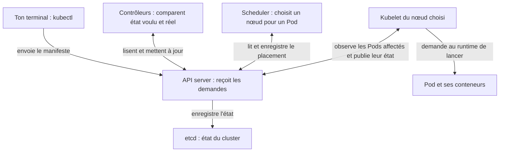

Le scheduler choisit le nœud ; c'est le kubelet de ce nœud qui fait exécuter le Pod. Les contrôleurs passent par l'API pour réconcilier les ressources.

Utilise un profil dédié pour séparer ce TP de tes autres clusters :

```powershell
minikube version # Affiche la version installée de Minikube.
minikube start -p kube-tuto --cpus=2 --memory=4096 # Crée ou démarre le profil kube-tuto avec 2 CPU et 4096 Mio de RAM.
minikube status -p kube-tuto # Vérifie que les composants du profil kube-tuto fonctionnent.
kubectl config use-context kube-tuto # Dirige les prochaines commandes kubectl vers le cluster kube-tuto.
kubectl config current-context # Affiche le contexte actif pour vérifier quel cluster tu manipules.
kubectl get nodes -o wide # Liste les nœuds avec leurs adresses IP et leurs informations détaillées.
kubectl version # Affiche les versions de kubectl et du serveur Kubernetes.
kubectl create namespace kube-tuto # Crée le namespace qui contiendra les ressources du TP.
kubectl config set-context --current --namespace=kube-tuto # Choisit kube-tuto comme namespace par défaut du contexte actif.
```

Garde ton driver habituel. Si Minikube utilise Docker, Docker Desktop doit être démarré. Les 4 Go sont un point de départ pour les premiers ateliers, pas pour toutes les stacks du projet simultanément. L'atelier admission nécessite Kubernetes 1.30 ou plus récent.

Observe les composants du cluster :

```powershell
kubectl get pods -n kube-system # Liste les Pods des composants système du cluster.
kubectl api-resources # Liste les types de ressources que l'API du cluster sait gérer.
```

Tu envoies tes demandes à l'API server. Les contrôleurs cherchent à atteindre l'état demandé ; le scheduler choisit les nœuds ; le kubelet fait fonctionner les conteneurs sur son nœud. CoreDNS permet la résolution des noms des Services.

**À retenir :** `kubectl` parle au contexte sélectionné. Un namespace range les ressources ; il ne crée pas à lui seul une isolation réseau.

## 1. Un Pod est remplaçable

Compare un Pod autonome et un Pod géré :

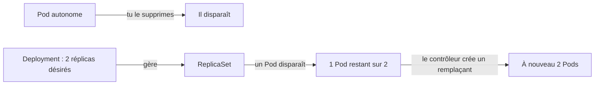

Crée un Pod autonome :

```powershell
kubectl run seul --image=nginx:stable-alpine --port=80 # Crée un Pod Nginx autonome ; --port déclare son port mais ne l'expose pas sur ton PC.
kubectl wait --for=condition=Ready pod/seul --timeout=120s # Attend au maximum 120 secondes que le Pod seul soit prêt.
kubectl get pods -o wide # Liste les Pods avec leur IP et le nœud qui les héberge.
kubectl describe pod seul # Affiche la configuration, l'état et les événements du Pod seul.
kubectl logs seul --tail=30 # Affiche les 30 dernières lignes des logs du conteneur.
kubectl exec seul -- hostname # Exécute hostname dans le conteneur pour afficher son nom d'hôte.
kubectl port-forward pod/seul 8080:80 # Relie localhost:8080 au port 80 du Pod ; laisse ce terminal ouvert.
```

La dernière commande reste ouverte. Dans un deuxième terminal, visite `http://localhost:8080`, puis relis les logs. Arrête le port-forward avec Ctrl+C.

```powershell
kubectl delete pod seul # Supprime le Pod autonome pour observer qu'il ne sera pas recréé.
kubectl get pods # Liste les Pods du namespace courant et leur état.
```

**Résultat attendu :** le Pod ne revient pas. Aucun contrôleur n'a demandé son remplacement.

**Question :** pourquoi un conteneur démarré manuellement ne suffit-il pas pour garantir deux instances de ton application ?

## 2. Deployment, Service et ConfigMap : une application complète

Deux relations différentes : les contrôleurs gèrent les Pods ; le Service permet de les joindre.

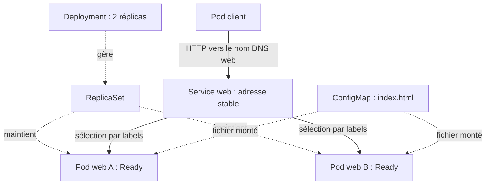

Les Pods peuvent changer d'IP ; les clients continuent d'utiliser le nom du Service. Les flèches pointillées représentent ici la gestion ou la configuration, pas des requêtes HTTP.

Crée `web.yaml` :

```yaml
apiVersion: v1
kind: ConfigMap
metadata:
  name: web-page
  labels:
    app.kubernetes.io/name: web
data:
  index.html: |
    <h1>KUBE - version 1</h1>
    <p>Cette page vient d'une ConfigMap.</p>
---
apiVersion: apps/v1
kind: Deployment
metadata:
  name: web
  labels:
    app.kubernetes.io/name: web
spec:
  replicas: 2
  minReadySeconds: 5
  progressDeadlineSeconds: 120
  strategy:
    type: RollingUpdate
    rollingUpdate:
      maxUnavailable: 0
      maxSurge: 1
  selector:
    matchLabels:
      app.kubernetes.io/name: web
  template:
    metadata:
      labels:
        app.kubernetes.io/name: web
    spec:
      containers:
        - name: web
          image: nginx:stable-alpine
          ports:
            - name: http
              containerPort: 80
          resources:
            requests:
              cpu: 50m
              memory: 32Mi
            limits:
              cpu: 250m
              memory: 128Mi
          readinessProbe:
            httpGet:
              path: /
              port: http
            periodSeconds: 2
          livenessProbe:
            httpGet:
              path: /
              port: http
            initialDelaySeconds: 5
            periodSeconds: 5
          volumeMounts:
            - name: page
              mountPath: /usr/share/nginx/html
              readOnly: true
      volumes:
        - name: page
          configMap:
            name: web-page
---
apiVersion: v1
kind: Service
metadata:
  name: web
  labels:
    app.kubernetes.io/name: web
spec:
  selector:
    app.kubernetes.io/name: web
  ports:
    - name: http
      port: 80
      targetPort: http
```

```powershell
kubectl apply -f web.yaml # Crée ou met à jour les ressources pour correspondre au fichier web.yaml.
kubectl rollout status deployment/web --timeout=120s # Attend au maximum 120 secondes la fin du déploiement de web.
kubectl get deployment,replicaset,pods,service # Affiche ensemble le Deployment, ses ReplicaSets, les Pods et les Services.
kubectl get pods --show-labels # Affiche les labels des Pods pour comprendre leur sélection par le Service.
kubectl get endpointslices -l kubernetes.io/service-name=web # Affiche les EndpointSlices qui décrivent les destinations du Service web.
kubectl port-forward service/web 8080:80 # Relie localhost:8080 à un Pod du Service web ; laisse ce terminal ouvert.
```

Ouvre `http://localhost:8080`. Le port-forward est un accès de débogage qui sélectionne un Pod ; ce n'est pas une démonstration du load balancing du Service. Il peut s'arrêter si ce Pod disparaît.

Le chemin normal depuis un autre Pod est :

```text
Client du cluster → nom DNS web → Service → un Pod prêt
Deployment → ReplicaSet → maintient le nombre demandé de Pods
ConfigMap → fichiers montés dans les Pods
```

Dans un autre terminal :

```powershell
kubectl run client --image=busybox:1.37 --restart=Never --command -- sleep 3600 # Crée un Pod de test qui reste actif une heure pour exécuter des commandes réseau.
kubectl wait --for=condition=Ready pod/client --timeout=120s # Attend au maximum 120 secondes que le Pod client soit prêt.
kubectl exec client -- wget -qO- http://web # Envoie une requête HTTP depuis le Pod client et affiche la page du Service web.
kubectl exec client -- nslookup web.kube-tuto.svc.cluster.local # Vérifie depuis le Pod client la résolution DNS du Service web.
$webPod = kubectl get pods -l app.kubernetes.io/name=web -o jsonpath='{.items[0].metadata.name}' # Stocke dans $webPod le nom du premier Pod portant le label de web.
kubectl delete pod $webPod # Supprime ce Pod web pour observer son remplacement par le contrôleur.
kubectl get pods -w # Observe les changements des Pods en direct ; Ctrl+C arrête seulement l'observation.
```

**Résultat attendu :** un nouveau Pod apparaît, avec un autre nom. Ctrl+C quitte l'observation sans arrêter l'application.

### Expérience : casser le lien Service → Pods

```powershell
kubectl set selector service/web app.kubernetes.io/name=inexistant # Change le selector du Service pour qu'il ne trouve volontairement plus de Pod.
kubectl get endpointslices -l kubernetes.io/service-name=web # Affiche les EndpointSlices qui décrivent les destinations du Service web.
kubectl exec client -- wget -T 3 -qO- http://web # Teste le Service cassé depuis le client avec un délai réseau de 3 secondes.
kubectl apply -f web.yaml # Crée ou met à jour les ressources pour correspondre au fichier web.yaml.
```

Les Pods sont sains, mais le Service ne les sélectionne plus. Le diagnostic réseau commence souvent par les **labels, selectors, ports et endpoints**.

### Expérience : configuration et nombre de réplicas

Modifie le titre dans la ConfigMap de `web.yaml`, puis applique le fichier. Le fichier monté est actualisé après propagation, sans reconstruction de l'image. Ce n'est pas une mise à jour du template des Pods : cela ne produit pas une nouvelle révision du Deployment. Une configuration injectée par variable d'environnement nécessite, elle, un remplacement des Pods pour être relue.

```powershell
kubectl scale deployment/web --replicas=3 # Demande au Deployment de maintenir trois Pods web.
kubectl get pods # Liste les Pods du namespace courant et leur état.
kubectl apply -f web.yaml # Crée ou met à jour les ressources pour correspondre au fichier web.yaml.
kubectl get pods # Liste les Pods du namespace courant et leur état.
```

Le fichier demande toujours deux réplicas : son application ramène l'état désiré à deux. Cette différence entre une modification manuelle et la configuration déclarative prépare GitOps.

## 3. Readiness et déploiement défectueux

Pendant le rollout défectueux, le Pod supplémentaire existe mais ne reçoit pas le trafic du Service :

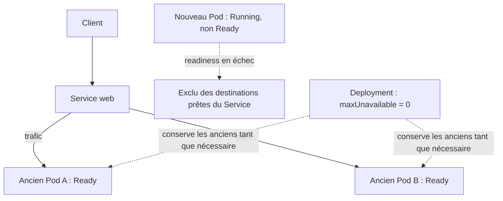

`Running` signifie que le Pod a démarré ; `Ready` signifie qu'il est prêt à servir. Le test de readiness fait la différence.

C'est une démonstration explicitement demandée à la soutenance : la nouvelle version est défectueuse et l'ancienne continue à servir.

- **Readiness** : ce Pod peut-il recevoir du trafic ? Un échec le retire des endpoints prêts.
- **Liveness** : faut-il redémarrer ce conteneur ? Un échec répété déclenche un redémarrage.
- **Startup probe** : utile pour une application lente à démarrer ; diffère l'activation des deux autres probes jusqu'à son succès.

Dans un terminal, laisse tourner un vrai client du Service :

```powershell
kubectl exec client -- sh -c 'while true; do wget -T 2 -qO- http://web || echo ECHEC; sleep 1; done' # Teste le Service en boucle chaque seconde ; affiche ECHEC si une requête échoue.
```

Crée `bad-readiness.yaml`, un **patch** et non un manifeste complet :

```yaml
spec:
  template:
    spec:
      containers:
        - name: web
          readinessProbe:
            httpGet:
              path: /page-inexistante
              port: http
```

```powershell
kubectl patch deployment web --type=strategic --patch-file bad-readiness.yaml # Fusionne le patch avec le Deployment pour casser la readiness de la nouvelle révision.
kubectl get pods -w # Observe les changements des Pods en direct ; Ctrl+C arrête seulement l'observation.
```

Dans un autre terminal :

```powershell
kubectl rollout status deployment/web --timeout=150s # Suit le rollout pendant 150 secondes ; l'échec du délai est attendu dans cet exercice.
kubectl describe deployment web # Affiche l'état du Deployment et les raisons possibles du blocage du rollout.
kubectl get endpointslices -l kubernetes.io/service-name=web -o yaml # Affiche les destinations du Service et leurs conditions de disponibilité en YAML.
kubectl rollout history deployment/web # Liste les révisions enregistrées du Deployment web.
```

**Attendu :** deux anciens Pods restent prêts ; le nouveau reste `0/1`, même s'il est `Running`. Le Service continue de répondre. `maxUnavailable: 0` interdit de retirer les anciens Pods tant que les remplaçants ne sont pas disponibles. `maxSurge: 1` autorise un Pod supplémentaire.

Le timeout ou `ProgressDeadlineExceeded` est attendu. Kubernetes **ne réalise pas automatiquement un rollback** à l'expiration de ce délai.

```powershell
kubectl rollout undo deployment/web # Rétablit le template de Pods de la révision précédente du Deployment.
kubectl rollout status deployment/web --timeout=120s # Attend au maximum 120 secondes la fin du déploiement de web.
```

Pour une démonstration encore plus réaliste, refais ensuite cet atelier avec une nouvelle image de l'application qui répond mal au healthcheck. Ici, le changement de probe suffit à apprendre le mécanisme.ddddddddRepère à quel moment se produit le problème :

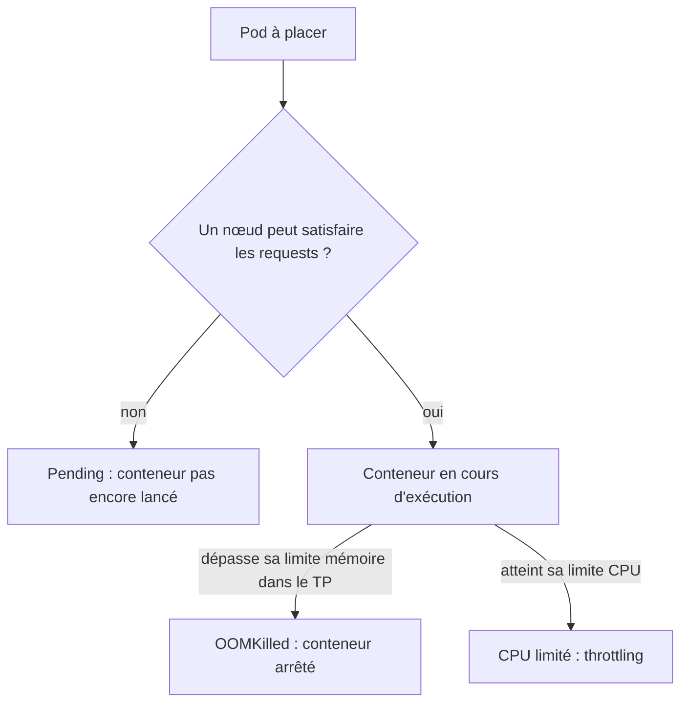

Ce schéma isole les ressources CPU/RAM ; d'autres contraintes, comme l'affinité ou le stockage, peuvent également empêcher le placement.

`100m` de CPU correspond à 0,1 cœur. Les requests servent notamment au placement ; les limits bornent l'utilisation. Dépasser la limite CPU provoque généralement du throttling, pas un OOM. Dépasser la limite mémoire peut provoquer un arrêt par manque de mémoire.

### A. Provoquer un Pending

Crée `pending.yaml` :

```yaml
apiVersion: v1
kind: Pod
metadata:
  name: trop-gros
  labels:
    app.kubernetes.io/name: experience
spec:
  containers:
    - name: pause
      image: busybox:1.37
      command: ["sh", "-c", "sleep 3600"]
      resources:
        requests:
          cpu: "100"
          memory: 32Mi
        limits:
          cpu: "100"
          memory: 64Mi
```

```powershell
kubectl apply -f pending.yaml # Crée le Pod dont la demande CPU est volontairement impossible à satisfaire.
kubectl describe pod trop-gros # Affiche notamment les événements expliquant pourquoi le Pod reste Pending.
kubectl delete -f pending.yaml # Supprime les ressources décrites dans pending.yaml après l'expérience.
```

**Attendu :** `FailedScheduling`, `Insufficient cpu`. Il demande cent cœurs : aucun nœud du TP ne peut l'accueillir. Le conteneur n'a pas démarré. Baisser une limite ne provoque pas à lui seul cette situation ; c'est la demande de placement qui doit être impossible à satisfaire.

### B. Provoquer un OOMKilled

Crée `oom.yaml` :

```yaml
apiVersion: v1
kind: Pod
metadata:
  name: gourmand
  labels:
    app.kubernetes.io/name: experience
spec:
  restartPolicy: Never
  containers:
    - name: python
      image: python:3.12-alpine
      command: ["python", "-c", "import time; time.sleep(5); data = bytearray(256 * 1024 * 1024); time.sleep(60)"]
      resources:
        requests:
          cpu: 50m
          memory: 32Mi
        limits:
          cpu: 250m
          memory: 64Mi
```

```powershell
kubectl apply -f oom.yaml # Crée le Pod qui va dépasser sa limite mémoire.
kubectl get pod gourmand -w # Observe le Pod gourmand jusqu'à son arrêt ; Ctrl+C quitte l'observation.
kubectl describe pod gourmand # Affiche la raison de terminaison du conteneur, notamment OOMKilled.
kubectl delete -f oom.yaml # Supprime les ressources décrites dans oom.yaml après l'expérience.
```

**Attendu :** après téléchargement de l'image, le conteneur démarre puis termine avec `Reason: OOMKilled`. Il tente d'allouer 256 Mio sous une limite de 64 Mio.

À distinguer de `ImagePullBackOff` (image inaccessible) et de `CrashLoopBackOff` (redémarrages répétés avec temporisation).

## 5. Exposer l'application avec un Ingress

Le chemin suivi par la requête dans ce TP :

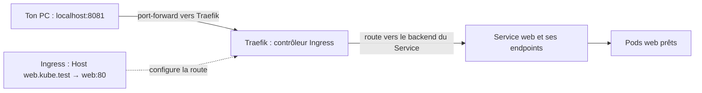

L'Ingress est une règle ; Traefik est le logiciel qui la lit et traite les requêtes. Le Service représente le backend ; selon la configuration du contrôleur, celui-ci peut contacter directement ses endpoints.

Un Service `ClusterIP` donne un point d'accès interne. Un Ingress décrit des règles HTTP ; un **Ingress controller** exécute ces règles. Créer uniquement l'objet Ingress ne suffit pas.

On utilise ici Traefik via Helm. Vérifie d'abord que `helm version` fonctionne ; sinon installe Helm depuis sa documentation officielle.

```powershell
helm repo add traefik https://traefik.github.io/charts # Enregistre le dépôt qui distribue les charts Helm de Traefik.
helm repo update # Actualise la liste des charts disponibles dans les dépôts Helm configurés.
helm upgrade --install traefik traefik/traefik --namespace traefik --create-namespace --set service.type=ClusterIP --wait --timeout 5m # Installe ou met à jour Traefik en ClusterIP, crée son namespace et attend jusqu'à 5 minutes.
kubectl get ingressclass # Liste les classes d'Ingress pour vérifier que traefik est disponible.
```

Pour rendre le résultat reproductible dans le projet, relève la version du chart avec `helm list -n traefik` et fixe-la ensuite avec `--version`.

Crée `ingress.yaml` :

```yaml
apiVersion: networking.k8s.io/v1
kind: Ingress
metadata:
  name: web
  labels:
    app.kubernetes.io/name: web
spec:
  ingressClassName: traefik
  rules:
    - host: web.kube.test
      http:
        paths:
          - path: /
            pathType: Prefix
            backend:
              service:
                name: web
                port:
                  number: 80
```

```powershell
kubectl apply -f ingress.yaml # Crée ou met à jour la règle qui associe le nom web.kube.test au Service web.
kubectl port-forward -n traefik service/traefik 8081:80 # Relie localhost:8081 à l'entrée HTTP de Traefik ; laisse ce terminal ouvert.
```

Depuis un autre terminal :

```powershell
curl.exe -H "Host: web.kube.test" http://localhost:8081 # Teste la route Traefik en envoyant le nom d'hôte attendu dans l'en-tête HTTP.
curl.exe -H "Host: inconnu.kube.test" http://localhost:8081 # Teste un nom d'hôte sans route correspondante pour observer la réponse 404.
```

**Attendu :** ta page avec le bon Host ; une réponse 404 de Traefik avec le mauvais. Le chemin est maintenant `client → Traefik → backend web`. Le port-forward vers Traefik évite les particularités d'accès à l'IP Minikube sur Windows ; il sert uniquement au TP.

Dans AWS, le sujet demande une entrée par `kube-1`, avec IP publique stable, NodePort et noms sslip.io/nip.io. Un NodePort ne transforme pas automatiquement un port élevé en port public 443 : il faudra documenter le chemin réseau réel et les ports ouverts.

## 6. Secret, PostgreSQL et stockage persistant

Ce qui change et ce qui reste après la suppression du Pod :

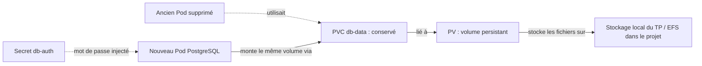

Le Secret configure l'accès ; le volume conserve les données. Supprimer le Pod ne supprime pas le PVC de cet atelier.

On utilise volontairement des manifests directs pour apprendre les objets. **Dans le rendu du projet, la base devra être déployée avec son chart**, conformément au sujet.

Crée un mot de passe jetable, seulement pour cette base locale :

```powershell
kubectl create secret generic db-auth --from-literal=POSTGRES_PASSWORD=mot-de-passe-jetable-du-tp # Crée le Secret contenant le mot de passe jetable de PostgreSQL pour ce TP.
kubectl label secret db-auth app.kubernetes.io/name=db # Ajoute au Secret un label qui indique son appartenance à la base.
kubectl get secret db-auth # Affiche les métadonnées du Secret sans afficher son mot de passe.
kubectl get storageclass # Liste les classes de stockage et repère celle marquée par défaut.
```

Le mot de passe de démonstration apparaît dans l'historique de commande : n'utilise pas une vraie valeur sensible. `Secret.data` est encodé en base64, ce n'est pas du chiffrement. Un YAML de Secret encodé en base64 ne doit pas être commité avec des identifiants réels. Le projet demande Sealed Secrets ou External Secrets.

Crée `db.yaml` :

```yaml
apiVersion: v1
kind: PersistentVolumeClaim
metadata:
  name: db-data
  labels:
    app.kubernetes.io/name: db
spec:
  accessModes: [ReadWriteOnce]
  resources:
    requests:
      storage: 1Gi
---
apiVersion: apps/v1
kind: Deployment
metadata:
  name: db
  labels:
    app.kubernetes.io/name: db
spec:
  replicas: 1
  strategy:
    type: Recreate
  selector:
    matchLabels:
      app.kubernetes.io/name: db
  template:
    metadata:
      labels:
        app.kubernetes.io/name: db
    spec:
      containers:
        - name: postgres
          image: postgres:17-alpine
          env:
            - name: POSTGRES_PASSWORD
              valueFrom:
                secretKeyRef:
                  name: db-auth
                  key: POSTGRES_PASSWORD
            - name: PGDATA
              value: /var/lib/postgresql/data/pgdata
          ports:
            - containerPort: 5432
          resources:
            requests:
              cpu: 100m
              memory: 128Mi
            limits:
              cpu: 500m
              memory: 256Mi
          readinessProbe:
            exec:
              command: ["pg_isready", "-U", "postgres"]
            initialDelaySeconds: 5
            periodSeconds: 5
          volumeMounts:
            - name: data
              mountPath: /var/lib/postgresql/data
      volumes:
        - name: data
          persistentVolumeClaim:
            claimName: db-data
---
apiVersion: v1
kind: Service
metadata:
  name: db
  labels:
    app.kubernetes.io/name: db
spec:
  selector:
    app.kubernetes.io/name: db
  ports:
    - port: 5432
      targetPort: 5432
```

```powershell
kubectl apply -f db.yaml # Crée ou met à jour le PVC, le Deployment PostgreSQL et son Service.
kubectl rollout status deployment/db --timeout=180s # Attend au maximum 180 secondes que le Deployment de la base soit disponible.
kubectl get pvc # Liste les demandes de stockage du namespace et leur état, par exemple Bound.
kubectl get pv # Liste les volumes persistants du cluster et leur liaison à un PVC.
kubectl exec deployment/db -- psql -U postgres -c 'CREATE TABLE IF NOT EXISTS preuves (id integer PRIMARY KEY); INSERT INTO preuves VALUES (42) ON CONFLICT DO NOTHING;' # Exécute du SQL dans PostgreSQL pour créer la table et enregistrer la valeur 42.
kubectl delete pod -l app.kubernetes.io/name=db # Supprime le Pod de la base sélectionné par son label, sans supprimer son PVC.
kubectl rollout status deployment/db --timeout=180s # Attend au maximum 180 secondes que le Deployment de la base soit disponible.
kubectl exec deployment/db -- psql -U postgres -c 'SELECT * FROM preuves;' # Relit la table pour vérifier que la valeur 42 a survécu au remplacement du Pod.
```

Si le dernier accès est trop rapide, attends que le nouveau Pod soit `1/1` avant de réessayer. **La ligne 42 doit être présente.** Le Pod a changé, mais il monte le même PVC.

Si le PVC reste Pending, regarde `kubectl describe pvc db-data`. Il faut une StorageClass par défaut et un provisionneur disponibles. Sur le profil Minikube standard, vérifie les addons `storage-provisioner` et `default-storageclass`.

- **PVC** : demande de stockage de l'application.
- **PV** : volume disponible ou créé pour satisfaire cette demande.
- **StorageClass** : modalités de provisionnement.
- **StatefulSet** : identités stables et éventuellement un PVC par réplique ; il ne configure pas tout seul la réplication PostgreSQL.

Le Deployment mono-instance avec `Recreate` évite ici de lancer deux serveurs sur le même répertoire. Ne passe pas simplement `db` à trois réplicas : PostgreSQL a besoin d'une architecture de réplication dédiée. Modifier le Secret ne change pas automatiquement le mot de passe d'une base déjà initialisée.

Le stockage local de ce TP ne garantit pas la mobilité des données entre nœuds. Pour le projet, le PV doit être adossé à l'EFS partagé fourni. Le sujet exige la survie aux redémarrages des Pods, pas à la suppression complète du cluster. Un PVC n'est pas une sauvegarde.

## 7. CronJob : faire un contrôle périodique réel

Trois objets, trois responsabilités :

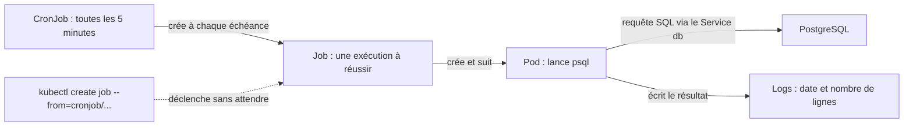

Crée `db-report.yaml` :

```yaml
apiVersion: batch/v1
kind: CronJob
metadata:
  name: db-report
  labels:
    app.kubernetes.io/name: db-report
spec:
  schedule: "*/5 * * * *"
  concurrencyPolicy: Forbid
  successfulJobsHistoryLimit: 1
  failedJobsHistoryLimit: 2
  jobTemplate:
    spec:
      backoffLimit: 1
      activeDeadlineSeconds: 60
      template:
        metadata:
          labels:
            app.kubernetes.io/name: db-report
        spec:
          restartPolicy: Never
          containers:
            - name: report
              image: postgres:17-alpine
              env:
                - name: PGPASSWORD
                  valueFrom:
                    secretKeyRef:
                      name: db-auth
                      key: POSTGRES_PASSWORD
              command: ["psql"]
              args: ["-h", "db", "-U", "postgres", "-v", "ON_ERROR_STOP=1", "-c", "SELECT now(), count(*) AS lignes FROM preuves;"]
              resources:
                requests:
                  cpu: 50m
                  memory: 32Mi
                limits:
                  cpu: 250m
                  memory: 64Mi
```

```powershell
kubectl apply -f db-report.yaml # Crée ou met à jour le CronJob qui interrogera périodiquement la base.
kubectl create job --from=cronjob/db-report rapport-manuel # Déclenche immédiatement un Job à partir du CronJob, sans attendre son horaire.
kubectl wait --for=condition=complete job/rapport-manuel --timeout=90s # Attend au maximum 90 secondes la réussite du Job manuel.
kubectl logs job/rapport-manuel # Affiche le résultat SQL écrit dans les logs du Pod du Job.
kubectl get cronjobs,jobs # Liste les planifications CronJob et les exécutions Job du namespace.
```

**Attendu :** une date et le nombre de lignes. Le CronJob programme ; le Job supervise une exécution ; un Pod réalise le travail. Le test utilise le DNS et l'authentification de la base via son Service.

Prolongement : remplace le rapport par un `pg_dump` vers un stockage de sauvegarde et teste une restauration. Un dump écrit dans le système de fichiers éphémère du conteneur ne constitue pas une sauvegarde durable.

## 8. Répartir les réplicas sur plusieurs nœuds

Avec une anti-affinité stricte pour les Pods web, chaque nœud ne peut accueillir qu'un de ces Pods :

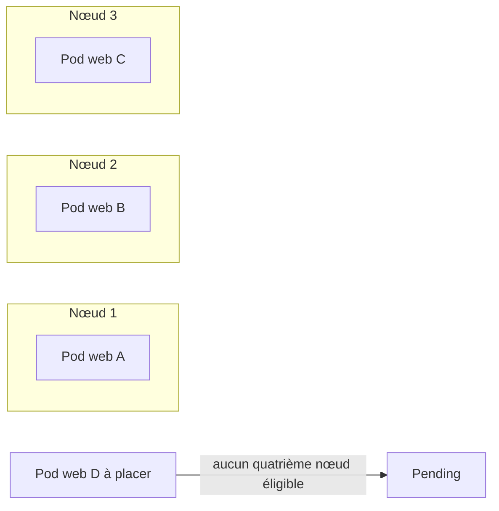

Pour deux réplicas, le troisième nœud laisse une place au Pod temporaire d'un rollout. Pour quatre réplicas, il manque un nœud.

Termine la démonstration de persistance avant cet atelier. Ajouter des nœuds augmente la mémoire nécessaire au profil. Si ta machine manque de RAM, utilise cet atelier séparément des stacks supplémentaires.

```powershell
minikube node add -p kube-tuto # Ajoute un nœud au profil kube-tuto ; chaque exécution ajoute un nœud supplémentaire.
minikube node add -p kube-tuto # Ajoute un nœud au profil kube-tuto ; chaque exécution ajoute un nœud supplémentaire.
kubectl get nodes -L kubernetes.io/hostname # Liste les nœuds avec le label utilisé pour distinguer leurs noms d'hôte.
```

Crée `affinity.yaml`, un patch :

```yaml
spec:
  template:
    spec:
      affinity:
        podAntiAffinity:
          requiredDuringSchedulingIgnoredDuringExecution:
            - labelSelector:
                matchLabels:
                  app.kubernetes.io/name: web
              topologyKey: kubernetes.io/hostname
```

```powershell
kubectl patch deployment web --type=strategic --patch-file affinity.yaml # Ajoute au Deployment la règle qui sépare les Pods web entre les nœuds.
kubectl rollout status deployment/web --timeout=180s # Attend au maximum 180 secondes la fin du rollout de web.
kubectl get pods -l app.kubernetes.io/name=web -o wide # Affiche uniquement les Pods web avec leur nœud pour vérifier leur répartition.
```

**Attendu :** les deux Pods web sont sur deux nœuds différents. `required` impose la règle ; `preferred` exprime une préférence qui peut être ignorée si nécessaire.

Provoque un placement impossible :

```powershell
kubectl scale deployment/web --replicas=4 # Demande quatre Pods web pour provoquer un placement impossible dans cet atelier.
kubectl get pods -l app.kubernetes.io/name=web -o wide # Affiche uniquement les Pods web avec leur nœud pour vérifier leur répartition.
```

Décris le Pod Pending avec `kubectl describe pod NOM_DU_POD`. Avec trois nœuds et une anti-affinité stricte, le quatrième ne peut pas être placé, même s'il reste du CPU.

```powershell
kubectl scale deployment/web --replicas=2 # Ramène l'état désiré à deux Pods web après l'expérience.
```

**Point essentiel pour le projet :** deux réplicas strictement séparés, deux seuls nœuds éligibles, `maxUnavailable: 0` et `maxSurge: 1` peuvent bloquer un rollout : le Pod supplémentaire n'a aucune place. Ici, le troisième nœud permet le remplacement progressif. Sur AWS, vérifie les taints et l'éligibilité effective de `kube-1`, ou adapte la stratégie et la règle de placement. La disponibilité se raisonne avec la capacité disponible.

Pour répéter le test de readiness de l'atelier 3, vérifie d'abord que le rollout courant est terminé.

## 9. Créer ton propre chart Helm

Comment tes valeurs deviennent des ressources Kubernetes :

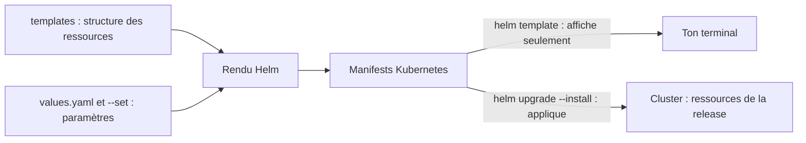

Une release est une installation nommée d'un chart, ici `hello`. Son historique permet de revenir à une révision précédente.

Helm transforme des templates et des valeurs en objets Kubernetes. Il gère aussi des releases. Il ne surveille pas continuellement un dépôt Git.

Crée cette arborescence, sans utiliser `helm create` pour bien voir le minimum :

```text
chart-web/
  Chart.yaml
  values.yaml
  templates/
    deployment.yaml
    service.yaml
```

`chart-web/Chart.yaml` :

```yaml
apiVersion: v2
name: chart-web
description: Application de demonstration KUBE
type: application
version: 0.1.0
appVersion: "1"
```

`chart-web/values.yaml` :

```yaml
replicaCount: 2
image: nginx:stable-alpine
servicePort: 80
```

`chart-web/templates/deployment.yaml` :

```yaml
apiVersion: apps/v1
kind: Deployment
metadata:
  name: {{ .Release.Name }}
  labels:
    app.kubernetes.io/name: chart-web
    app.kubernetes.io/instance: {{ .Release.Name }}
spec:
  replicas: {{ .Values.replicaCount }}
  strategy:
    type: RollingUpdate
    rollingUpdate:
      maxUnavailable: 0
      maxSurge: 1
  selector:
    matchLabels:
      app.kubernetes.io/instance: {{ .Release.Name }}
  template:
    metadata:
      labels:
        app.kubernetes.io/name: chart-web
        app.kubernetes.io/instance: {{ .Release.Name }}
    spec:
      containers:
        - name: web
          image: {{ .Values.image | quote }}
          ports:
            - containerPort: 80
          readinessProbe:
            httpGet:
              path: /
              port: 80
          livenessProbe:
            httpGet:
              path: /
              port: 80
            initialDelaySeconds: 5
          resources:
            requests:
              cpu: 50m
              memory: 32Mi
            limits:
              cpu: 250m
              memory: 128Mi
```

`chart-web/templates/service.yaml` :

```yaml
apiVersion: v1
kind: Service
metadata:
  name: {{ .Release.Name }}
  labels:
    app.kubernetes.io/name: chart-web
    app.kubernetes.io/instance: {{ .Release.Name }}
spec:
  selector:
    app.kubernetes.io/instance: {{ .Release.Name }}
  ports:
    - port: {{ .Values.servicePort }}
      targetPort: 80
```

```powershell
helm lint ./chart-web # Vérifie la structure du chart et détecte des erreurs courantes sans le déployer.
helm template hello ./chart-web # Affiche les manifests générés pour la release hello sans les envoyer au cluster.
helm upgrade --install hello ./chart-web -n kube-tuto --wait # Installe ou met à jour la release hello avec le chart local et attend sa disponibilité.
helm upgrade hello ./chart-web -n kube-tuto --set replicaCount=3 --wait # Met à jour hello en remplaçant replicaCount par 3 pour cette release.
helm history hello -n kube-tuto # Affiche les révisions et le statut de la release Helm hello.
helm rollback hello 1 -n kube-tuto --wait # Rétablit la révision 1 de la release Helm et attend la disponibilité des ressources.
kubectl get pods -l app.kubernetes.io/instance=hello # Liste les Pods qui appartiennent à la release hello grâce à leur label d'instance.
helm uninstall hello -n kube-tuto # Désinstalle la release hello et les ressources gérées par ce chart.
```

Cette application utilise la page Nginx par défaut. Exercice : intègre la ConfigMap, l'Ingress et l'anti-affinité des ateliers précédents, puis rends les ressources configurables dans `values.yaml`. Fixe une version d'image ou un digest pour une vraie livraison ; les tags `stable-alpine` du TP sont mobiles.

Pour la base du projet : sélectionne le chart correspondant au moteur réel de l'application, lis son `values.yaml` et sa documentation, configure un Secret existant et la persistance. Les paramètres de réplication varient selon le chart. Ne suppose pas qu'un simple `replicaCount: 3` crée une base répliquée.

## 10. Kustomize : une base, plusieurs environnements

La base reste commune ; chaque overlay précise les différences de son environnement :

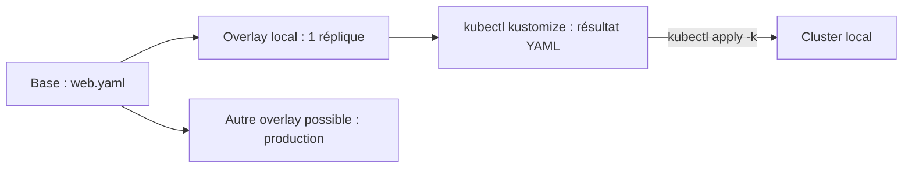

L'overlay de production illustre une extension possible ; seul l'overlay local est créé dans cet atelier.

Crée :

```text
gitops-app/
  base/
    web.yaml
    kustomization.yaml
  overlays/
    local/
      kustomization.yaml
```

Copie le `web.yaml` de l'atelier 2 dans `base/`. Ne copie pas les manifests de panne. Pour cette expérience, on revient à cette base simple, sans l'anti-affinité ajoutée au cluster.

`base/kustomization.yaml` :

```yaml
apiVersion: kustomize.config.k8s.io/v1beta1
kind: Kustomization
resources:
  - web.yaml
```

`overlays/local/kustomization.yaml` :

```yaml
apiVersion: kustomize.config.k8s.io/v1beta1
kind: Kustomization
namespace: kube-gitops
resources:
  - ../../base
replicas:
  - name: web
    count: 1
```

```powershell
kubectl create namespace kube-gitops # Crée le namespace distinct utilisé pour l'expérience GitOps.
kubectl kustomize ./gitops-app/overlays/local # Affiche les manifests résultant de la base et de l'overlay sans les appliquer.
kubectl apply -k ./gitops-app/overlays/local # Construit les manifests avec Kustomize puis les applique au cluster.
kubectl get deployment -n kube-gitops # Vérifie le nombre de réplicas des Deployments du namespace GitOps.
```

**Attendu :** un Deployment à une réplique dans un namespace distinct. Change le `count` à deux, visualise avec `kubectl diff -k ...`, puis applique. Un code de sortie 1 de `kubectl diff` signifie qu'il existe des différences.

Helm fabrique des manifests à partir de templates ; Kustomize compose et modifie des manifests. Dans le projet, documente leur articulation : par exemple Argo CD rend le chart applicatif, tandis que Kustomize organise les objets Application et les composants par environnement. Évite deux mécanismes qui gèrent indépendamment le même objet.

## 11. GitOps : observer une réconciliation

Argo CD compare régulièrement l'état demandé dans Git et l'état réel :

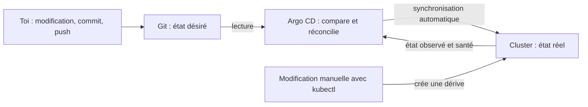

Avec `selfHeal`, Argo CD corrige la dérive. `Synced` compare Git et les ressources ; `Healthy` décrit leur santé.

Cet atelier nécessite un dépôt Git que le cluster peut lire. Place `gitops-app/` dans ce dépôt et pousse les fichiers. Pour simplifier le premier essai, un dépôt public ne contenant aucun secret convient. Un dépôt privé nécessite de configurer ses identifiants dans Argo CD.

Installe Argo CD suivant la [documentation officielle](https://argo-cd.readthedocs.io/en/stable/getting_started/). Pour ce laboratoire, le manifeste du canal stable peut être utilisé ; pour le projet, fixe une version :

```powershell
kubectl create namespace argocd # Crée le namespace destiné aux composants Argo CD.
kubectl apply -n argocd --server-side --force-conflicts -f https://raw.githubusercontent.com/argoproj/argo-cd/stable/manifests/install.yaml # Installe Argo CD côté serveur ; --force-conflicts impose la propriété des champs en conflit.
kubectl rollout status deployment/argocd-server -n argocd --timeout=300s # Attend au maximum 300 secondes la disponibilité du serveur Argo CD.
```

Cette installation ajoute plusieurs composants et consomme de la mémoire. Si des Pods restent Pending, consulte leurs événements et alloue davantage de ressources avant de poursuivre.

Crée `application.yaml`, en remplaçant l'URL et la branche par celles de ton dépôt :

```yaml
apiVersion: argoproj.io/v1alpha1
kind: Application
metadata:
  name: web-local
  namespace: argocd
spec:
  project: default
  source:
    repoURL: https://github.com/TON-COMPTE/TON-DEPOT.git
    targetRevision: main
    path: gitops-app/overlays/local
  destination:
    server: https://kubernetes.default.svc
    namespace: kube-gitops
  syncPolicy:
    automated:
      prune: true
      selfHeal: true
    syncOptions:
      - CreateNamespace=true
```

```powershell
kubectl apply -f application.yaml # Crée la ressource Application qui indique à Argo CD quel dépôt et chemin surveiller.
kubectl get applications -n argocd -w # Observe en direct les états de synchronisation et de santé des Applications Argo CD.
```

**Attendu :** `Synced` et `Healthy`. Un premier `Unknown` peut être transitoire ; s'il persiste, utilise `kubectl describe application web-local -n argocd`.

Expériences :

1. Change le nombre de réplicas dans Git, commit et push. Observe la réconciliation, qui peut prendre quelques minutes.
2. Lance `kubectl scale deployment/web -n kube-gitops --replicas=4`. Avec `selfHeal`, Argo CD rétablit la valeur déclarée dans Git.
3. Ajoute dans Git un patch de readiness défectueuse inspiré de l'atelier 3. Observe le rollout bloqué, puis corrige par un nouveau commit ou un revert.

**Synced ne veut pas dire Healthy.** Le cluster peut correspondre exactement aux fichiers Git tout en exécutant une configuration défectueuse. Une fois GitOps actif, corrige la source Git ; une correction manuelle seule risque d'être annulée.

Le sujet distingue infrastructure et application : deux dépôts ou deux dossiers séparés sont acceptés. L'installation des composants et l'application métier n'ont pas le même cycle de vie.

## 12. Admission native : refuser une ressource non conforme

La règle est évaluée avant l'enregistrement de la ressource :

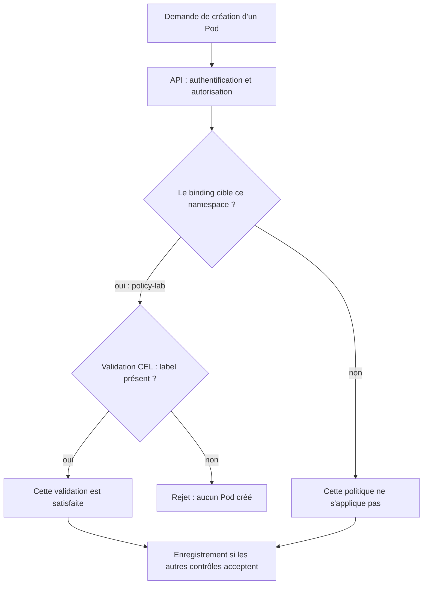

La policy définit la règle ; le binding précise où et comment l'appliquer. L'admission ne remplace pas les permissions RBAC.

On limite la politique à un namespace jetable pour ne pas bloquer les composants système. Crée-le :

```powershell
kubectl create namespace policy-lab # Crée le namespace jetable auquel sera limitée la politique d'admission.
kubectl api-resources | Select-String ValidatingAdmission # Filtre les types de ressources pour vérifier la présence de l'admission native.
```

Crée `policy.yaml` :

```yaml
apiVersion: admissionregistration.k8s.io/v1
kind: ValidatingAdmissionPolicy
metadata:
  name: kube-tuto-label
spec:
  failurePolicy: Fail
  matchConstraints:
    resourceRules:
      - apiGroups: [""]
        apiVersions: ["v1"]
        operations: ["CREATE", "UPDATE"]
        resources: ["pods"]
  validations:
    - expression: "has(object.metadata.labels) && 'app.kubernetes.io/name' in object.metadata.labels"
      message: "Le label app.kubernetes.io/name est obligatoire."
---
apiVersion: admissionregistration.k8s.io/v1
kind: ValidatingAdmissionPolicyBinding
metadata:
  name: kube-tuto-label
spec:
  policyName: kube-tuto-label
  validationActions: [Deny]
  matchResources:
    namespaceSelector:
      matchLabels:
        kubernetes.io/metadata.name: policy-lab
```

```powershell
kubectl apply -f policy.yaml # Crée ou met à jour la politique CEL et le binding qui l'active dans policy-lab.
kubectl get validatingadmissionpolicy kube-tuto-label -o yaml # Affiche la politique complète, y compris ses éventuels avertissements de typage.
kubectl run refuse -n policy-lab --image=nginx:stable-alpine --restart=Never # Tente de créer un Pod sans le label obligatoire pour vérifier son rejet.
kubectl run accepte -n policy-lab --image=nginx:stable-alpine --restart=Never --labels=app.kubernetes.io/name=demo # Crée un Pod avec le label obligatoire pour vérifier son acceptation.
kubectl get pods -n policy-lab # Liste les Pods du namespace de test pour constater ceux qui ont été acceptés.
```

Après propagation de la politique, la première création doit être refusée avec ton message ; la seconde est acceptée. Inspecte également les éventuels avertissements de typage de la politique. Si le premier essai a eu lieu trop tôt et a réussi, supprime `refuse`, attends quelques secondes et réessaie.

Une politique ciblant les Pods peut laisser créer un Deployment puis refuser les Pods créés par son ReplicaSet. Dans ce cas, inspecte les événements du ReplicaSet. Pour rejeter directement un Deployment, il faut aussi valider son `spec.template` avec des règles adaptées.

Défi : ajoute la validation CEL suivante pour imposer CPU et mémoire dans les limits de chaque conteneur :

```yaml
    - expression: "object.spec.containers.all(c, has(c.resources) && has(c.resources.limits) && 'cpu' in c.resources.limits && 'memory' in c.resources.limits)"
      message: "Chaque conteneur doit definir des limits CPU et memoire."
```

Ajoute-la dans la liste `validations` de `policy.yaml`. Le Pod `accepte`, qui n'a pas de limits, sera désormais refusé à la création : prépare un manifeste conforme à partir de `pending.yaml`, avec des requests CPU de `50m` et limits de `250m`. Cette règle pédagogique ne couvre pas les init containers ni la validité de toutes les valeurs ; complète-la pour la politique du projet.

## 13. Les autres exigences : expériences à faire ensuite

Les ateliers précédents constituent le socle pratique. Les étapes ci-dessous sont des extensions guidées : elles ne prétendent pas fournir une installation complète de la plateforme du sujet.

### Métriques et logs

```powershell
minikube addons enable metrics-server -p kube-tuto # Active le composant qui collecte les métriques CPU et mémoire récentes.
kubectl top nodes # Affiche la consommation CPU et mémoire récente de chaque nœud.
kubectl top pods -n kube-tuto # Affiche la consommation CPU et mémoire récente des Pods du TP.
kubectl logs -n kube-tuto deployment/web --tail=30 # Affiche les 30 dernières lignes des logs d'un Pod du Deployment web.
kubectl get events -n kube-tuto --sort-by=.metadata.creationTimestamp # Liste les événements du TP par date de création pour suivre les incidents.
```

Attends la collecte initiale si les métriques ne sont pas encore disponibles. `metrics-server` fournit des métriques de ressources récentes ; il ne remplace pas une stack de monitoring avec historique et alertes. `kubectl logs` ne remplace pas la centralisation des logs.

Pour le projet : installe progressivement Prometheus ou VictoriaMetrics, Grafana, puis Loki et un collecteur. Provoque une série d'erreurs HTTP, retrouve-les dans les logs, puis déclenche et acquitte une alerte. Pouvoir ouvrir Grafana ne prouve pas qu'une alerte fonctionne.

### HTTPS et certificats

Le chemin à comprendre est `client HTTPS → Ingress controller → Service → Pod`. Le certificat et sa clé sont généralement placés dans un Secret TLS, référencé par l'Ingress ; cert-manager automatise leur obtention et leur renouvellement.

En local, expérimente avec un certificat de développement ou un issuer local. Pour le projet, utilise cert-manager et Let's Encrypt. Un nom en `.test` et un poste inaccessible depuis Internet ne permettent pas de reproduire directement une validation ACME publique HTTP-01. Vérifie le challenge choisi et la joignabilité réelle de l'entrée AWS avant d'attendre un certificat.

Preuve recherchée : certificat valide pour le nom visité, connexion vérifiée sans désactiver les contrôles TLS, renouvellement compris. Le port-forward HTTP du TP ne satisfait pas cette exigence.

### Registry privée

Publie une image de ton application dans une registry privée, crée un Secret de type `kubernetes.io/dockerconfigjson`, puis référence-le via `imagePullSecrets` dans le Pod template. Le Secret doit être dans le namespace du workload.

Expérience : déploie un nouveau tag privé avec `imagePullPolicy: Always`, enlève les credentials pour une nouvelle création de Pod et observe les événements `ImagePullBackOff`, puis rétablis-les. Si le nœud dispose déjà de credentials globaux, ce test ne démontrera pas l'échec attendu : vérifie le mode d'authentification effectif. Ne commite ni token ni fichier Docker d'authentification.

### OIDC, Dex et autorisations

Le sujet demande un fournisseur d'identité dans votre cluster, par exemple Keycloak, et la fédération par Dex. Le parcours à comprendre est : utilisateur → outil ou kubectl → Dex → fournisseur d'identité → jeton vérifié par le destinataire.

Une connexion réussie à Grafana ne configure pas automatiquement Argo CD, Headlamp ou l'API Kubernetes. Chaque intégration a ses paramètres de client, redirect URI, issuer et confiance TLS ; l'API server doit aussi être configuré pour reconnaître l'identité.

OIDC authentifie. RBAC décide des actions autorisées. Après installation de l'identité, vérifie avec le contexte de l'utilisateur connecté :

```powershell
kubectl auth can-i get pods -n kube-tuto # Vérifie si l'identité du contexte actif peut lire les Pods du namespace kube-tuto.
kubectl auth can-i delete namespaces # Vérifie si l'identité du contexte actif peut supprimer des namespaces.
```

Un utilisateur de lecture devrait réussir le premier contrôle et échouer au second. Tester avec le contexte administrateur Minikube ne démontre pas l'intégration OIDC.

### Secrets dans Git

Choisis Sealed Secrets ou External Secrets, comme demandé. Avec Sealed Secrets, l'expérience consiste à chiffrer un secret pour le contrôleur, commiter uniquement le SealedSecret, observer la création du Secret et vérifier sa consommation par l'application. Avec External Secrets, il faut également un backend de secrets et l'accès à celui-ci : le contrôleur seul n'est pas un coffre-fort.

## 14. Mini-soutenance : vérifier que tu as compris

Sans recopier les explications, démontre et raconte :

1. Je supprime un Pod ; un autre revient parce qu'un contrôleur maintient l'état désiré.
2. Je casse le selector d'un Service ; les Pods restent sains mais les requêtes échouent.
3. Une nouvelle version échoue à sa readiness ; l'ancienne répond encore.
4. Je distingue Pending, OOMKilled et ImagePullBackOff à partir des événements et des statuts.
5. Une donnée PostgreSQL survit au remplacement de son Pod.
6. Mes deux réplicas sont sur deux nœuds différents, et je sais expliquer un rollout bloqué par le placement.
7. Mon CronJob produit un résultat d'exploitation vérifiable.
8. Mon chart produit des manifests différents selon ses valeurs.
9. Un commit déclenche une réconciliation ; une dérive manuelle est corrigée.
10. Une politique native refuse un Pod non conforme et accepte le manifeste corrigé.

Pour chacun, garde la commande, le résultat attendu et une capture ou sortie texte. C'est une bonne base de documentation pour la soutenance.

## Dépannage : l'ordre de recherche

```powershell
kubectl config current-context # Affiche le contexte actif pour vérifier quel cluster tu manipules.
kubectl get pods -A # Liste les Pods de tous les namespaces pour repérer où se situe le problème.
kubectl describe pod NOM -n NAMESPACE # Affiche les détails et événements du Pod ; remplace NOM et NAMESPACE par tes valeurs.
kubectl logs NOM -n NAMESPACE --tail=100 # Affiche les 100 dernières lignes des logs du Pod indiqué.
kubectl logs NOM -n NAMESPACE --previous # Affiche les logs de l'instance précédente du conteneur, si elle existe.
kubectl get events -n NAMESPACE --sort-by=.metadata.creationTimestamp # Liste les événements du namespace indiqué dans l'ordre de leur création.
```

`--previous` sert uniquement s'il existe une instance précédente du conteneur. Pour plusieurs conteneurs, ajoute `-c NOM_DU_CONTENEUR`.

| Symptôme | Première piste |
|---|---|
| Pending | Events : requests, affinité, taints, PVC |
| Running mais 0/1 | Readiness et démarrage réel de l'application |
| OOMKilled | État terminated/lastState, limites mémoire |
| CrashLoopBackOff | Logs, `--previous`, commande et configuration |
| ImagePullBackOff | Image, tag, accès réseau, authentification registry |
| Service inaccessible | Selector, EndpointSlice, port/targetPort |
| 404 à travers l'Ingress | Host, chemin, classe et contrôleur |
| PVC Pending | StorageClass, provisionneur, événements |
| ReplicaSet FailedCreate | Admission et événements du ReplicaSet |
| Argo Synced mais non Healthy | Configuration appliquée, mais application défaillante |

## Nettoyage du laboratoire

Arrêter sans supprimer :

```powershell
minikube stop -p kube-tuto # Arrête le profil kube-tuto en conservant son état et ses données locales.
```

Supprimer définitivement le profil **et les données locales du TP**, uniquement lorsque tu n'en as plus besoin :

```powershell
minikube delete -p kube-tuto # Supprime définitivement le profil kube-tuto et les données locales de ce cluster.
```

Le profil dédié permet de nettoyer les ressources de portée cluster comme l'admission sans toucher à un autre profil. Les fichiers locaux et ton dépôt Git restent présents.

## Références

Sources du parcours : `kube-bootstrap.pdf` (bases, ressources, Helm, persistance, CronJob, admission) et `kube-project.pdf` (objectifs, bonnes pratiques, infrastructure et soutenance), version 2.0.0 fournie.

- [Kubernetes : Deployments et comportement d'un rollout bloqué](https://kubernetes.io/docs/concepts/workloads/controllers/deployment/).
- [Kubernetes : volumes persistants](https://kubernetes.io/docs/concepts/storage/persistent-volumes/) et [application stateful mono-instance](https://kubernetes.io/docs/tasks/run-application/run-single-instance-stateful-application/).
- [Kubernetes : Secrets](https://kubernetes.io/docs/concepts/configuration/secret/).
- [Kubernetes : politiques d'admission natives](https://kubernetes.io/docs/reference/access-authn-authz/validating-admission-policy/).
- [Kubernetes : Kustomize](https://kubernetes.io/docs/tasks/manage-kubernetes-objects/kustomization/).
- [Helm : introduction aux templates](https://helm.sh/docs/chart_template_guide/getting_started/).
- [Minikube : accès aux applications](https://minikube.sigs.k8s.io/docs/handbook/accessing/) et [Traefik](https://minikube.sigs.k8s.io/docs/handbook/addons/traefik/).
- [Argo CD : installation et premiers pas](https://argo-cd.readthedocs.io/en/stable/getting_started/).

Les commandes ont été préparées pour ce parcours mais n'ont pas été exécutées sur ton cluster. Les images, charts et manifests upstream non épinglés peuvent évoluer ; conserve les versions utilisées pour rendre tes expériences reproductibles.
